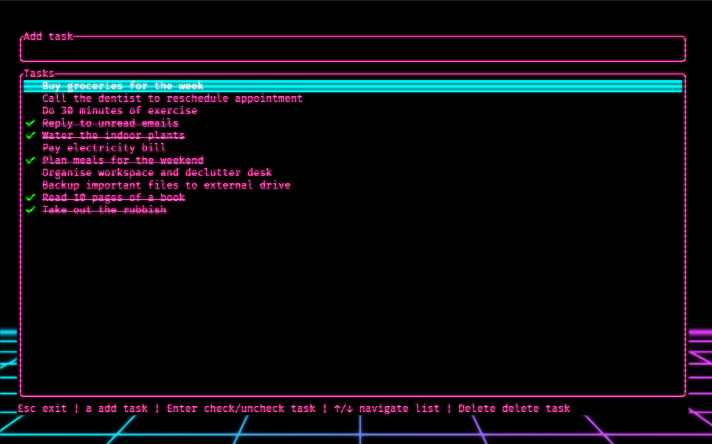
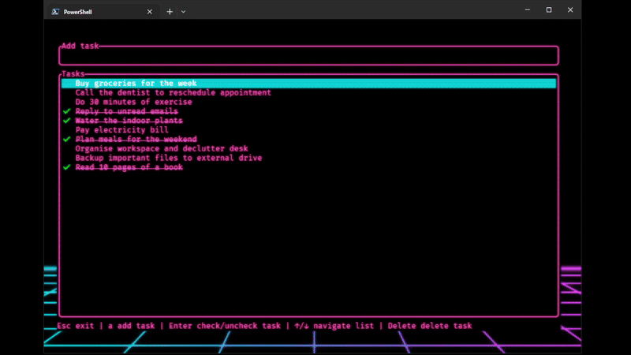

# 📝 CLI Todo List

A terminal-based task manager built with Rust, powered by **TUI** and **Crossterm**, featuring a neon-themed interface. Perfect for quick and clean task management right from your terminal window.



---

## Table of Contents

- [Features](#features)
- [Screenshot](#screenshot)
- [Installation](#installation)
- [Usage](#usage)
- [Keyboard Shortcuts](#keyboard-shortcuts)
- [Project Structure](#project-structure)
- [Dependencies](#dependencies)
- [License](#license)

---

## Features

- Add, check, uncheck, and delete tasks with ease
- Full keyboard navigation — no mouse required
- Neon retro aesthetic with visually distinct sections
- Tasks persist across sessions via file-based storage
- Modular Rust architecture using components like `widget`, `events`, and `file_handler`
- Built with [TUI-rs](https://github.com/fdehau/tui-rs) and [Crossterm](https://github.com/crossterm-rs/crossterm)

---

## Demo



---

## Installation

### Prerequisites

- [Rust & Cargo](https://www.rust-lang.org/tools/install)

### Clone and Build

```bash
git clone https://github.com/yourusername/neon-todo-cli.git
cd neon-todo-cli
cargo build --release
```

### Run the Application

```bash
cargo run
```

---

## Usage

1. Launch the app with `cargo run`
2. Use the keybindings below to navigate and manage your tasks
3. Tasks are saved automatically on exit

---

## Keyboard Shortcuts

| Key        | Action                     |
|------------|----------------------------|
| `a`        | Add a new task             |
| `Enter`    | Check/uncheck selected task |
| `↑ / ↓`    | Navigate task list         |
| `Delete`   | Delete selected task       |
| `Esc`      | Exit the application       |


---

## Dependencies

- [`tui`](https://crates.io/crates/tui)
- [`crossterm`](https://crates.io/crates/crossterm)
- [`serde`](https://crates.io/crates/serde)
- [`serde_json`](https://crates.io/crates/serde_json)

Install them via `cargo.toml` as needed.

---

## License

This project is licensed under the MIT License. See `LICENSE` for more information.

---

## Inspiration

Built for fun and productivity to boost my knowledge of Rust. Ideal for terminal enthusiasts who like their task lists fast and visually striking.

---
